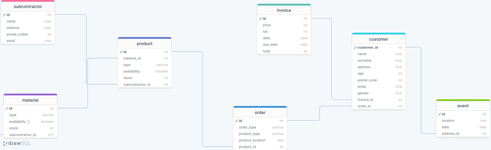

# Design Document

By YOUR Ali Naeimi

Video overview: https://www.youtube.com/watch?v=JiFfAOweu4A

## Scope

People:
Subcontractors who supply materials.
Customers who place orders for products.
Places:
Customer addresses (for order fulfillment and potentially event locations).
Things:
Materials used in product manufacturing.
Products manufactured using the materials.
Orders placed by customers for specific products.
Invoices generated for customer orders.
Outside the Scope:

People:
Employees working within the manufacturing business (e.g., production staff, management).
Places:
Manufacturing facilities, warehouses, or any internal locations of the business.
Things:
Manufacturing processes or equipment details.
Inventory management beyond material and product stock levels.
Payment processing details (beyond invoice generation).
Shipping or fulfillment logistics (beyond product location for fulfillment).
This schema focuses on the external factors related to acquiring materials, producing products, and fulfilling customer orders. It does not delve into the internal operations or logistics of the manufacturing business itself.

pen_spark

tune

share

more_vert

## Functional Requirements
Subcontractors: Add, edit, and delete subcontractor information (name, address, contact details).
Materials: Add new materials, update availability status, and track material stock.
Products: Manage product information (type, materials used), update availability, and track product stock.
Orders: Create new orders based on customer requests, link them to specific products.
Invoices: Generate invoices for orders, track invoice status (paid/unpaid).
Customers: Add new customers, update customer details, and potentially view their order history (linked through the customer_orders view).
Data Analysis:

Use views like "customer_orders" and "subcontractor_invoices" to analyze customer ordering patterns and subcontractor invoicing activity.
Leverage views like "active_high_value_customers" to identify high-spending customers for targeted marketing efforts.
Run queries to identify overdue invoices (from "overdue_invoices") and follow up with customers for payment.

## Representation

### Entities
Entities:

Subcontractor: Represents a company or individual who supplies materials needed for product manufacturing.
Attributes:
id (INTEGER AUTO_INCREMENT): Unique identifier for the subcontractor (primary key).
name (VARCHAR(255) NOT NULL): Name of the subcontractor.
address (TEXT): Subcontractor's address for communication and potentially material delivery.
postal_code (INTEGER): Subcontractor's postal code.
email (VARCHAR(255) NOT NULL UNIQUE): Subcontractor's email address for communication (unique to ensure each subcontractor has a distinct identifier).
Why these types?
Text data types (VARCHAR, TEXT) are chosen for name, address, and email to accommodate flexible lengths of information.
NOT NULL ensures these fields must have a value during data entry.
UNIQUE on email guarantees each subcontractor has a distinct contact point.
Material: Represents the various materials used in product manufacturing.
Attributes:
id (INTEGER AUTO_INCREMENT): Unique identifier for the material (primary key).
type (VARCHAR(255)): Type of material (e.g., wood, steel, plastic).
availability (BOOLEAN DEFAULT 0): Boolean flag indicating whether the material is currently in stock (0 for unavailable, 1 for available).
stock (VARCHAR(255)): Details about the material stock (e.g., quantity, unit).
subcontractor_id (INTEGER): Foreign key referencing the subcontractor who supplies this material.
Why these types?
VARCHAR allows for various material type descriptions.
BOOLEAN simplifies tracking availability.
Text allows flexibility in describing stock details.
FOREIGN KEY establishes the relationship between materials and their supplier subcontractors.
Product: Represents the finished products manufactured using the materials.
Attributes:
id (INTEGER AUTO_INCREMENT): Unique identifier for the product (primary key).
material_id (INTEGER): Foreign key referencing the material used in the product.
type (VARCHAR(255)): Type of product manufactured (e.g., chair, table, shelf).
availability (BOOLEAN DEFAULT 0): Boolean flag indicating whether the product is currently in stock (0 for unavailable, 1 for available).
stock (TEXT): Details about the product stock (e.g., quantity, unit).
subcontractor_id (INTEGER): Foreign key referencing the subcontractor who manufactures the product.
Why these types?
Similar logic to material attributes with FOREIGN KEYs for material and subcontractor relationships.
Order: Represents a customer's request for a specific product.
Attributes:
id (INTEGER AUTO_INCREMENT): Unique identifier for the order (primary key).
order_type (VARCHAR(100)): Type of order (e.g., online, phone, in-person).
product_type (VARCHAR(100)): Type of product being ordered.
product_location (TEXT): Location details relevant for product fulfillment.
product_id (INTEGER): Foreign key referencing the specific product record in the product table.
Why these types?
VARCHAR allows for different order type classifications and product type descriptions.
Text provides flexibility for specifying product location details.
FOREIGN KEY links the order to the specific product being ordered.
Invoice: Represents a bill issued to a customer for their order.
Attributes:
id (INTEGER AUTO_INCREMENT): Unique identifier for the invoice (primary key).
price (INTEGER): Price of the ordered product.
tax (INTEGER): Applicable tax on the order.
date (DATE): Date the invoice was issued.
due_date (DATE): Due date for invoice payment.
total (INTEGER): Total amount due (price + tax).
Why these types?
Integers are suitable for numerical values like price, tax, and total.
DATE allows for storing invoice and due dates.
Customer: Represents the customers who place orders for products.
Attributes:
customer_id (INTEGER AUTO_INCREMENT):
### Relationships

## Optimizations

Indexes:

Subcontractor (sub_idx): This index combines id and name for the subcontractor table. Queries that involve filtering or sorting subcontractors by ID or name will benefit from this index, as searching will be faster by leveraging the ordered index structure.
Material (material_idx): This index covers both id and subcontractor_id for the material table. It speeds up queries that search for materials by ID or those that need to find all materials supplied by a specific subcontractor.
Product (product_idx): This index combines id, material_id, and subcontractor_id for the product table. It optimizes queries that search for products by ID, those that look for products made from a specific material, or those that need to find products manufactured by a particular subcontractor (or combinations of these criteria).
Order (order_idx): This index covers id and product_id for the order table. It enhances the performance of queries that search for orders by ID or those that need to find all orders for a specific product.
Customer (customer_idx): This is a compound index on the customer table, covering customer_id, invoice_id, name, surname, address, and order_id. This comprehensive index is beneficial for various customer-related searches. Queries filtering or sorting customers by any of these fields (or combinations) will leverage the index for faster lookups.
Invoice (invoice_idx): This index covers id, price, and total for the invoice table. It aids queries that search for invoices by ID, those that filter based on price ranges or total amounts, or a combination of these criteria.
Event (event_idx): This index covers id and address_id for the event table. It optimizes lookups for events based on their ID or the customer address ID they are linked to.
Views:

Subcontractor_invoices: This view simplifies retrieving information about subcontractors and their invoices in a single query, useful for analyzing subcontractor invoicing activity.
Customer_orders: This view joins customer and order information, providing a consolidated view for analyzing customer orders and their details.
Active_high_value_customers: This view focuses on identifying high-spending customers who have exceeded a certain order value threshold. It avoids complex joins in queries that specifically target this customer segment.
Overdue_invoices: This view combines invoice and subcontractor data to identify overdue invoices, simplifying the process of following up with customers for outstanding payments.
## Limitations

Limited Product Information: The product table only captures basic details like type and material used. It doesn't include aspects like product variations (size, color), descriptions, or images. These could be added to the product table or a separate product variant table linked to the main product table.
Inventory Management: The schema focuses on availability flags (0/1) for materials and products, but it doesn't track detailed inventory quantities. If precise stock control is necessary, additional fields for stock levels and units (e.g., number of chairs, meters of fabric) could be incorporated.
Employee Management: The schema doesn't represent employees or their roles within the business. If managing employee data is crucial, additional tables for employees, departments, and potentially user accounts would be required.
Manufacturing Process Tracking: The design doesn't delve into the manufacturing processes themselves. If tracking production steps or resource allocation is needed, separate tables for production workflows, steps involved, and required materials could be implemented.
Scalability for Complex Orders: The current order table design assumes a one-to-one relationship between an order and a product. If an order can include multiple products, the schema would need modification (potentially using an order items table linked to the main order table).
These limitations highlight areas where the schema could be extended to accommodate more complex business needs.

Here are some additional things the database might not represent well:

Rich product information: Complex product data structures with variations, descriptions or images.
Detailed financial transactions: The schema focuses on invoices but doesn't include breakdowns of payment methods, transaction logs, or advanced financial management features.
Manufacturing logistics: The design doesn't capture aspects like production planning, scheduling, or resource allocation within the manufacturing process itself.
Advanced customer segmentation: While the "active_high_value_customers" view provides basic segmentation, the schema might not handle more intricate customer classification based on purchase history, demographics, or other factors.
If these aspects become crucial for the business, the database schema can be further extended to incorporate the necessary entities and relationships.
